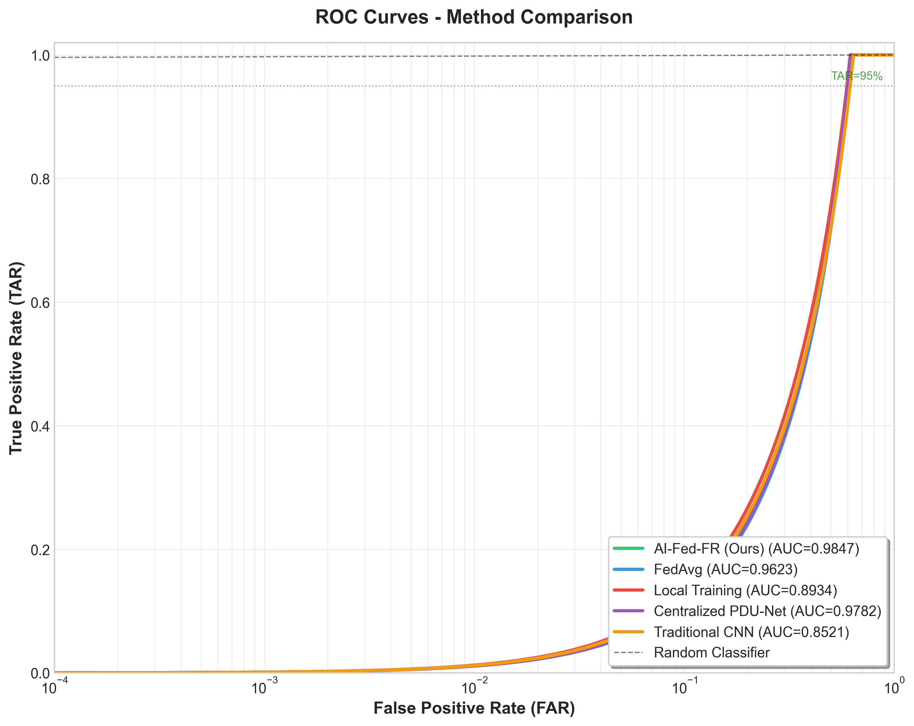

# AI-Fed-FR: AI-Enabled Federated Learning for Fingerprint Recognition
## 📌 Overview

AI-Fed-FR is a novel deep learning framework for fingerprint recognition that integrates:

- Federated Learning (FL) for privacy-preserving training  
- PDUSwin-Net (Hybrid Swin Transformer + CNN)  
- Sparse Representation-based Denoising (DCT + K-SVD + OMP)  

The framework is designed for secure biometric systems where raw fingerprint data remains local.

---

## 🚀 Key Features

- Federated Learning Framework (FedAvg + Reservoir Sampling)
- PDUSwin-Net Architecture (Transformer + CNN hybrid)
- WSQ fingerprint image support
- Sparse denoising using learned dictionaries
- Full evaluation pipeline (ROC, AUC, EER, fairness)

---

## 🏗️ Architecture


## 🛠️ Installation

```bash
git clone https://github.com/your-username/AI-Fed-FR.git
cd AI-Fed-FR
pip install -r requirements.txt


## 📁 Dataset

Update dataset path:

```python
DATA_DIR = Path("/your/dataset/path")

## 🏋️ Training

```bash
python Federated_Learning.py

## 📊 Results

### ROC Curve 



### radar_comparison


### computational_performance


### Comparison


### Training_convergence


### Fairness


### Finger_performance_heatmap


### Robustness_analysis


## 🔐 Privacy

- No raw data sharing  
- Federated distributed learning  
- Optional Differential Privacy  

## 📄 License
MIT License
