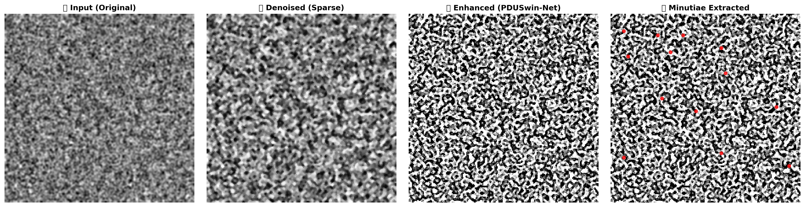

# AI-Fed-FR: AI-Enabled Federated Learning for Fingerprint Recognition

## 📌 Overview

AI-Fed-FR is a novel deep learning framework for fingerprint recognition that integrates:

- Federated Learning (FL) for privacy-preserving training
- PDUSwin-Net (Hybrid Swin Transformer + CNN)
- Sparse Representation-based Denoising (DCT + K-SVD + OMP)

The framework is designed for secure biometric systems where raw fingerprint data remains local.

---

## 🚀 Key Features

- Federated Learning Framework (FedAvg + Reservoir Sampling)
- PDUSwin-Net Architecture (Transformer + CNN hybrid)
- WSQ fingerprint image support
- Sparse denoising using learned dictionaries
- Full evaluation pipeline (ROC, AUC, EER, fairness)

---

## 🏗️ Architecture


---

## 🛠️ Installation

```bash
git clone https://github.com/your-username/AI-Fed-FR.git
cd AI-Fed-FR
pip install -r requirements.txt
```

---

## 📁 Dataset

### Overview

| Property | Details |
|---|---|
| **Format** | WSQ (Wavelet Scalar Quantization) |
| **Total Images** | 11,350 |
| **Unique Subjects** | 119 |
| **Sessions** | 2 |
| **Session 1** | 5,950 images |
| **Session 2** | 5,400 images |

### Directory Structure

```
Fingerprint/
├── Session1/    # 5950 files, 5950 images
└── Session2/    # 5400 files, 5400 images
```

### Sample Files

```
7060_l_2_09.wsq
7016_l_2_07.wsq
7003_l_1_09.wsq
```

### Update Dataset Path

```python
DATA_DIR = Path("/your/dataset/path/Fingerprint")
```

> **Note:** Dataset contains WSQ format fingerprint images. Ensure the WSQ PIL plugin is installed before running (`WSQ PIL plugin registered successfully`).

---

## ⚙️ Hardware Specifications

### Compute Environment

| Component | Specification |
|---|---|
| **Primary GPU** | NVIDIA TITAN V |
| **VRAM (Primary)** | 12,288 MiB (~12.64 GB) |
| **CUDA Version** | 11.8 |
| **Driver Version** | 535.288.01 |
| **Active Device** | CUDA |
| **CUDA Benchmark Mode** | Enabled |

> Training was primarily performed on **NVIDIA TITAN V** (GPU 0) with CUDA 11.8 and cuDNN Benchmark mode enabled for optimized performance.

---

## 🏋️ Training

```bash
python Federated_Learning.py
```

---

---## 🔍 Visualization 



**Pipeline Stages:**
1. 📥 **Input:** Original fingerprint image
2. 🧹 **Denoised:** Sparse representation-based denoising
3. ✨ **Enhanced:** PDUSwin-Net output
4. 🎯 **Minutiae:** Detected ridge endings and bifurcations

---

---## 📊 Results

### ROC Curve

> DET curve comparison showing the trade-off between False Match Rate and False Non-Match Rate across all federated clients.


---

### Radar Comparison

> Multi-metric radar chart comparing PDUSwin-Net against baseline models across AUC, EER, accuracy, and fairness dimensions.


---

### Computational Performance

> Comparison of inference time, memory usage, and FLOPs across models to evaluate computational efficiency.


---

### Performance Comparison

> Bar chart comparing recognition accuracy and AUC of PDUSwin-Net against CNN, Swin Transformer, and other baselines.


---

### Training Convergence

> Federated training loss and accuracy curves over communication rounds, showing stable convergence across all clients.


---

### Client Fairness

> Per-client performance distribution illustrating equitable model accuracy across all federated participants.


---

### Finger Performance Heatmap

> Heatmap showing recognition accuracy for each finger type, highlighting performance variation across different biometric inputs.


---

### Robustness Analysis

> Model performance under various noise levels and image quality degradations, demonstrating the effectiveness of sparse denoising.


---

## 🔐 Privacy

- No raw data sharing
- Federated distributed learning
- Optional Differential Privacy

---

## 📄 License

MIT License
